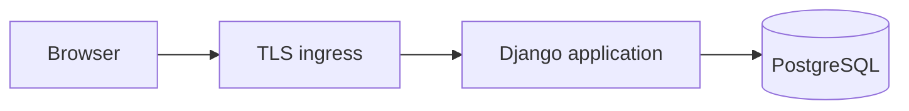

# Common Thread architecture

Status: architecture specified; portable container deployment selected for testing;
no application implemented.

## Application boundary

Build the CRM as an independently runnable application with its own persistence
and versioned API. Begin with a modular application rather than distributing
its core across multiple services. Use a Django server-rendered modular monolith
and PostgreSQL as specified in the ADRs. See the [Architect handoff](architect-handoff.md)
for decisions, frozen contracts, and Stage 0.

Keep people, organizations, households, relationships, interactions, contextual
notes, and commitments in the common domain. Professional modules can add typed
engagements and workflows referencing stable core identifiers. Do not make a
real-estate pipeline, an opportunity, or a legal matter mandatory to use the CRM.

An interaction can involve several people and organizations. Store it once and
link participants, so correcting it updates the shared history consistently.
Relationships should support roles and effective dates. Keep contact points
separate from identity: an email address can change or be shared and should not
serve as a permanent person identifier.

The eventual access model must apply consistently to records, search, attachments,
and any AI retrieval. Detailed authorization and retention design belongs in the
implementation specification before real client information is introduced.

## Kelsey Knows Omaha integration

The existing `kcrealestate` code has PostgreSQL people and email-contact tables
supporting newsletters, including subscription, consent, and delivery records.
That is an integration starting point, not the full CRM to extract.

Proposed ownership:

| Information | Authoritative application |
| --- | --- |
| CRM person profiles, relationships, notes, and commitments | Standalone CRM |
| Newsletter subscriptions, preferences, consent, suppression, and delivery | Kelsey Knows Omaha |
| Property and community-event records | Kelsey Knows Omaha |
| Mapping between existing contact IDs and CRM IDs | Integration adapter |

Kelsey Knows Omaha should use an API adapter with an explicit external-ID mapping,
not read or modify CRM database tables directly. Existing newsletter contact
records can remain local references; avoid introducing two competing editable
person profiles. Define field ownership before synchronizing any profile data.

Do not automatically treat subscribers or property owners as clients. Linking
existing records needs explicit matching rules and review of ambiguous matches.
Newsletter consent remains authoritative in Kelsey Knows Omaha; a CRM edit must
not imply subscription or erase an unsubscribe.

Start integration with opening a linked CRM person from Kelsey Knows Omaha.
Add bounded API reads or writes only as the user workflow requires them. For
eventual asynchronous synchronization, specify idempotency, retries, conflict
handling, and reconciliation before enabling it. Newsletter signup and delivery
should continue to work during a CRM outage.

## Implementation sequence

1. Review the proposed core against fictional examples from all three professions.
2. Choose the stack and specify schema, authentication, and record access.
3. Deliver a person page with relationships, history, and commitments end to end.
4. Validate the complete first milestone as a standalone product.
5. Define and implement the first Kelsey Knows Omaha integration contract.

Open design decisions include production hosting, future team-sharing rules,
extension mechanism, and whether integrations initially open the standalone
interface or embed selected CRM views.

## Runtime topology

One app owns templates, same-origin JSON adapters, authorization, and domain services.
PostgreSQL owns persistent records and sessions. No queue, cache, AI service, or
separate frontend is required. The ingress implementation follows the selected
host. mini-hp01 hosts the testing Compose stack; runtime configuration keeps the
image usable by other projects and container hosts. See
[ADR 0004](adr/0004-choose-a-portable-container-and-mini-hp01-testing-deployment.md).
